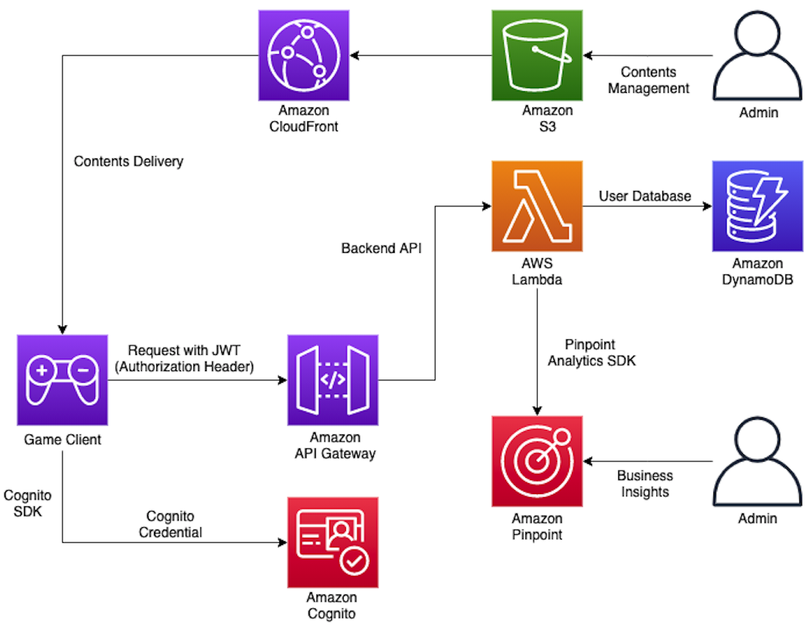

# Welcome to AWS Singleplay Application Workshop

This sample includes how to integrate AWS services on their single-application especially for Mobile environment.

Client developers who do not know much about backend service implementation could easily try this sample for their application to use AWS on their service.

[!] In this sample, we are trying to make it with a simple indie game, but this sample-architecture can cover most of applications.

## This sample Includes

- How to make Content distribution for your application
- How to manage user accounts based on AWS
- How to implement Serverless backend for maintenance
- How to integrate with Database for Cloud backup (Synchronization)
- How to analyze Usage metrics such as DAU, MAU, Retention and Monetization

## Workshop URL

You can try this sample with Web-based workshop this link. 

EN : [Workshop Link (English)](http://jinspark-game-starter-workshop.s3-website-us-east-1.amazonaws.com/en/)

KO : [Workshop Link (Korean)](http://jinspark-game-starter-workshop.s3-website-us-east-1.amazonaws.com/ko/)

[!] Workshop link can be migrated to .aws domain. Please watch this repository. :) 

## For using this sample

This sample has been implemented based on Unity version 2020.1.6f1.
It has been tested the above version of Unity Engine.

This sample using Amazon Cognito SDK for .NET.
It is required to import libraries below.

- AWSSDK.CognitoIdentity.dll
- AWSSDK.CognitoIdentityProvider.dll
- AWSSDK.Core.dll
- AWSSDK.SecurityToken.dll
- Amazon.Extensions.CognitoAuthentication.dll

I recommend you to install the library using Nuget Package. Please follow the link below.
[https://docs.aws.amazon.com/sdk-for-net/v3/developer-guide/net-dg-install-assemblies.html](https://docs.aws.amazon.com/sdk-for-net/v3/developer-guide/net-dg-install-assemblies.html)

It is important to import dll into Assets>Plugin folder. Because Unity editor only import libraries inside of Assets.

[!] Or You can also use UnityPackage.unitypackage file to implement whole working demo into your environment.

## Questions?

If you have any queries, please feel free to contact us.

- Author : jinspark@amazon.com
- Korea Gaming Team : korea-gaming-sa@amazon.com

## License

This library is licensed under the MIT-0 License. See the LICENSE file.
